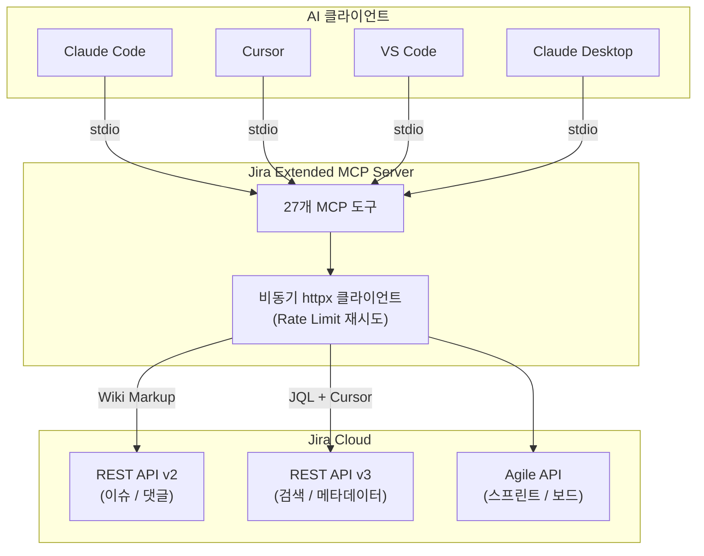

<p align="center">
  <h1 align="center">Jira Extended MCP Server</h1>
  <p align="center">
    <strong>AI 에이전트를 위한 Jira Cloud 통합 MCP 서버</strong><br />
    27개 도구 &middot; 벌크 작업 &middot; 리치 텍스트 &middot; 스프린트 &middot; 릴리스 &middot; 이슈 링크
  </p>
  <p align="center">
    <a href="#-빠른-시작"><strong>빠른 시작</strong></a> &middot;
    <a href="#-사용-예시"><strong>사용 예시</strong></a> &middot;
    <a href="#-도구-목록"><strong>도구 목록</strong></a> &middot;
    <a href="#%EF%B8%8F-설정"><strong>설정</strong></a>
  </p>
</p>

<p align="center">
  <a href="https://pypi.org/project/jira-extended-mcp/"></a>
  <a href="https://modelcontextprotocol.io"></a>
  <a href="https://www.python.org/downloads/"></a>
  <a href="LICENSE"></a>
</p>

<p align="center">
  한국어 | <a href="README.md">English</a>
</p>

---

> **Moobean Team** 제작 — 가볍고, Jira 전용, 최소 설정으로 바로 사용할 수 있는 MCP 서버입니다.

## 이 서버의 차별점

- **Jira 전용, 군더더기 없음** — Confluence 없이, 추가 모듈 없이. `uvx` 한 줄이면 바로 실행.
- **위키 마크업 지원** — Jira REST API v2를 사용해서 `*bold*`, `h2. Title`, `* bullet` 그대로 동작. ADF JSON 변환 불필요.
- **벌크 작업** — 이슈 최대 50개 한 번에 생성하거나 여러 이슈 상태를 일괄 전환.
- **릴리스 전체 관리** — 버전 생성, 수정, 삭제, 이슈 릴리스 배정까지.
- **이슈 링크** — 차단, 관련, 중복, 복제 — 생성, 조회, 삭제 모두 지원.

## 비교

> **참고:** 아래 기능 정보는 2026년 3월 기준 각 프로젝트의 README와 문서를 참고한 것입니다. 이후 변경되었을 수 있습니다.

| | [jira-mcp](https://github.com/CamdenClark/jira-mcp) | [mcp-atlassian](https://github.com/sooperset/mcp-atlassian) | [Atlassian Rovo MCP](https://github.com/atlassian/atlassian-mcp-server) | **Jira Extended** |
|---|---|---|---|---|
| 범위 | Jira 전용 | Jira + Confluence | Jira + Confluence + Compass | Jira 전용 |
| 이슈 CRUD | 읽기 전용 | 전체 CRUD | 전체 CRUD | 전체 CRUD |
| 벌크 생성 | - | 지원 | 지원 | **50개/호출** |
| 벌크 전환 | - | - | - | **지원** |
| 상위/하위 이슈 | - | 지원 | 지원 | 지원 |
| fixVersions | - | 지원 | 지원 | 지원 |
| 시작일 / 마감일 | - | 지원 | 지원 | 지원 |
| 이슈 링크 | - | 지원 | - | 지원 |
| 릴리스 관리 | - | - | - | **4개 도구** |
| 스프린트 관리 | - | 지원 | - | 지원 |
| 리치 텍스트 | - | Markdown → ADF | ADF | **위키 마크업 (v2 API)** |
| 설치 방식 | npm | pip / Docker | OAuth (클라우드 호스팅) | **`uvx` 한 줄** |
| Jira 도구 수 | 2 | ~30 (Jira 부분) | ~25 (Jira 부분) | 27 |
| 언어 | TypeScript | Python | 리모트 (SaaS) | Python |

## 사용 예시

AI 에이전트에게 자연어로 요청하면 됩니다:

**이슈 관리**
> "KAN 프로젝트에 에픽 하나 만들어줘. 제목은 '사용자 인증 시스템', 시작일 4월 1일, 마감일 4월 30일"

> "KAN-42 에픽 아래에 스토리 5개 만들어줘: 로그인, 회원가입, 비밀번호 재설정, 소셜 로그인, 2FA"

> "KAN 프로젝트에서 '진행 중' 상태인 이슈 다 보여줘"

**벌크 작업**
> "이 스프린트 백로그 10개 이슈를 한번에 '완료'로 전환해줘"

> "v2.0 릴리스에 포함된 이슈 목록 보여줘"

**릴리스 & 스프린트**
> "KAN 프로젝트에 v2.1.0 릴리스를 만들어줘. 릴리스 날짜는 5월 15일"

> "현재 활성 스프린트에 KAN-50, KAN-51 이슈를 옮겨줘"

**이슈 링크**
> "KAN-10이 KAN-20을 블록하고 있다고 링크 걸어줘"

**리치 텍스트 (위키 마크업)**
> "이슈 설명에 h2 제목이랑 불릿 리스트 넣어서 만들어줘"

## 빠른 시작

### 사전 준비

- [`uv`](https://docs.astral.sh/uv/) (Python 패키지 매니저 — Python 자동 설치)
- [Jira API 토큰](https://id.atlassian.com/manage-profile/security/api-tokens)

### 1단계: uv 설치

`uv`는 Python 패키지 매니저입니다. 없으면 설치:

```bash
# macOS / Linux
curl -LsSf https://astral.sh/uv/install.sh | sh

# Windows (PowerShell)
powershell -ExecutionPolicy ByPass -c "irm https://astral.sh/uv/install.ps1 | iex"
```

### 2단계: Jira API 토큰 발급

1. https://id.atlassian.com/manage-profile/security/api-tokens 접속
2. **Create API token** 클릭
3. 토큰 복사 — 다음 단계에서 사용

### 3단계: AI 클라이언트에 설정 추가

설정 파일 위치에 따라 범위가 달라집니다:

| 범위 | 파일 | 효과 |
|---|---|---|
| **글로벌** (권장) | `~/.claude.json` | 모든 프로젝트에서 사용 가능 |
| **프로젝트 전용** | 프로젝트 루트의 `.mcp.json` | 해당 프로젝트에서만 사용 |

<details open>
<summary><b>Claude Code</b></summary>

**가장 간단 — 명령어 한 줄:**
```bash
# macOS / Linux
claude mcp add jira-extended -s user \
  -e JIRA_URL=https://your-instance.atlassian.net \
  -e JIRA_EMAIL=your-email@example.com \
  -e JIRA_API_TOKEN=your-token \
  -- uvx jira-extended-mcp

# Windows — uvx.exe 사용 (uvx.cmd 래퍼의 stdio 문제 방지)
claude mcp add jira-extended -s user \
  -e JIRA_URL=https://your-instance.atlassian.net \
  -e JIRA_EMAIL=your-email@example.com \
  -e JIRA_API_TOKEN=your-token \
  -- uvx.exe jira-extended-mcp
```

> `-s user`는 글로벌 설치입니다. 생략하면 현재 프로젝트에만 설치됩니다.

**또는 설정 파일을 직접 편집:**

텍스트 에디터로 파일 열기:
```bash
# macOS / Linux
code ~/.claude.json    # 또는: nano ~/.claude.json

# Windows
notepad %USERPROFILE%\.claude.json
```

아래 내용 추가 (파일이 없으면 새로 생성):
```json
{
  "mcpServers": {
    "jira-extended": {
      "command": "uvx",
      "args": ["jira-extended-mcp"],
      "env": {
        "JIRA_URL": "https://your-instance.atlassian.net",
        "JIRA_EMAIL": "your-email@example.com",
        "JIRA_API_TOKEN": "your-api-token"
      }
    }
  }
}
```

> **Windows 사용자:** `"command": "uvx"` 대신 `"command": "uvx.exe"`를 사용하세요. Windows의 `uvx.cmd` 래퍼가 MCP stdio 통신을 방해합니다.

</details>

<details>
<summary><b>Claude Desktop</b></summary>

설정 파일을 텍스트 에디터로 열기:
```bash
# macOS
code ~/Library/Application\ Support/Claude/claude_desktop_config.json

# Windows
notepad %APPDATA%\Claude\claude_desktop_config.json
```

아래 내용을 추가 또는 병합:
```json
{
  "mcpServers": {
    "jira-extended": {
      "command": "uvx",
      "args": ["jira-extended-mcp"],
      "env": {
        "JIRA_URL": "https://your-instance.atlassian.net",
        "JIRA_EMAIL": "your-email@example.com",
        "JIRA_API_TOKEN": "your-api-token"
      }
    }
  }
}
```

> 이미 다른 MCP 서버가 설정되어 있다면, 기존 `"mcpServers"` 객체 안에 `"jira-extended": {...}` 블록만 추가하세요.
>
> **Windows 사용자:** `"command": "uvx"` 대신 `"command": "uvx.exe"`를 사용하세요.

</details>

<details>
<summary><b>VS Code (GitHub Copilot)</b></summary>

프로젝트 루트에 `.vscode/mcp.json` 생성:
```bash
mkdir -p .vscode
code .vscode/mcp.json
```

```json
{
  "servers": {
    "jira-extended": {
      "command": "uvx",
      "args": ["jira-extended-mcp"],
      "env": {
        "JIRA_URL": "https://your-instance.atlassian.net",
        "JIRA_EMAIL": "your-email@example.com",
        "JIRA_API_TOKEN": "your-api-token"
      }
    }
  }
}
```

> MCP 활성화: **Settings > Chat > MCP** 체크 필요. Agent 모드에서 동작합니다.
>
> **Windows 사용자:** `"command": "uvx"` 대신 `"command": "uvx.exe"`를 사용하세요.

</details>

<details>
<summary><b>Cursor</b></summary>

설정 파일 열기:
```bash
# macOS / Linux
code ~/.cursor/mcp.json

# Windows
notepad %USERPROFILE%\.cursor\mcp.json
```

```json
{
  "mcpServers": {
    "jira-extended": {
      "command": "uvx",
      "args": ["jira-extended-mcp"],
      "env": {
        "JIRA_URL": "https://your-instance.atlassian.net",
        "JIRA_EMAIL": "your-email@example.com",
        "JIRA_API_TOKEN": "your-api-token"
      }
    }
  }
}
```

> **Windows 사용자:** `"command": "uvx"` 대신 `"command": "uvx.exe"`를 사용하세요.

</details>

<details>
<summary><b>소스에서 설치 (개발용)</b></summary>

```bash
git clone https://github.com/moobean-team/jira-extended-mcp-server.git
cd jira-extended-mcp-server
uv pip install -e .
```

설정에서 `"command": "uvx"` 대신 `"command": "jira-extended-mcp"`를 사용하세요.

</details>

### 4단계: 재시작 & 확인

AI 클라이언트를 재시작한 후:

> "내 Jira 프로젝트 목록 보여줘"

프로젝트 목록이 보이면 설치 완료입니다.

## 설정

### 환경 변수

| 변수 | 필수 | 기본값 | 설명 |
|---|---|---|---|
| `JIRA_URL` | Yes | — | Jira Cloud 인스턴스 URL |
| `JIRA_EMAIL` | Yes | — | Atlassian 계정 이메일 |
| `JIRA_API_TOKEN` | Yes | — | [API 토큰](https://id.atlassian.com/manage-profile/security/api-tokens) |
| `JIRA_START_DATE_FIELD` | No | `customfield_10015` | 시작일 커스텀 필드 ID |

### 시작일 필드 ID 찾기

시작일 필드 ID는 Jira 인스턴스마다 다릅니다. `get_createmeta` 도구로 확인하거나:

```bash
curl -s -u email:token https://your-instance.atlassian.net/rest/api/2/field \
  | python -m json.tool | grep -i "start"
```

### 리치 텍스트 (위키 마크업)

이 서버는 Jira REST API v2를 사용하며, description과 comment 필드에 **Jira 위키 마크업** 문자열을 받습니다. Jira가 자동으로 리치 텍스트로 렌더링합니다.

| 문법 | 결과 |
|---|---|
| `*굵게*` | **굵게** |
| `_기울임_` | *기울임* |
| `h2. 섹션 제목` | H2 제목 |
| `* 항목 1\n* 항목 2` | 불릿 리스트 |
| `# 항목 1\n# 항목 2` | 번호 리스트 |
| `{code}print("hi"){code}` | 코드 블록 |
| `[링크 텍스트\|https://url]` | 하이퍼링크 |
| `\|열1\|열2\|\n\|a\|b\|` | 테이블 |

전체 레퍼런스: [Jira 위키 마크업](https://jira.atlassian.com/secure/WikiRendererHelpAction.jspa?section=texteffects)

## 도구 목록

<details open>
<summary><b>이슈 CRUD (6개)</b></summary>

| 도구 | 설명 |
|---|---|
| `create_issue` | 이슈 생성 — parent, fixVersions, startDate, dueDate, story points, components, 커스텀 필드 전부 지원 |
| `create_issues_bulk` | 최대 50개 이슈 일괄 생성 |
| `get_issue` | 이슈 상세 조회 (포맷팅된 출력) |
| `update_issue` | 이슈 필드 수정 (변경된 필드만 전송) |
| `delete_issue` | 이슈 삭제 (하위 이슈 처리 포함) |
| `search_issues` | JQL 검색 + 페이지네이션 |

</details>

<details>
<summary><b>상태 전환 (3개)</b></summary>

| 도구 | 설명 |
|---|---|
| `get_transitions` | 이슈의 가능한 상태 전환 목록 |
| `transition_issue` | 이름 또는 ID로 상태 전환 (댓글 추가 가능) |
| `bulk_transition` | 여러 이슈 일괄 상태 전환 |

</details>

<details>
<summary><b>이슈 링크 (3개)</b></summary>

| 도구 | 설명 |
|---|---|
| `link_issues` | 이슈 간 링크 생성 (Blocks, Relates, Duplicate, Cloners) |
| `get_issue_links` | 이슈의 모든 링크 조회 |
| `delete_issue_link` | 링크 삭제 |

</details>

<details>
<summary><b>릴리스 관리 (4개)</b></summary>

| 도구 | 설명 |
|---|---|
| `get_versions` | 프로젝트 버전/릴리스 목록 |
| `create_version` | 릴리스 생성 (시작일/릴리스 날짜 포함) |
| `update_version` | 릴리스 수정, 릴리스 완료/보관 처리 |
| `delete_version` | 릴리스 삭제 (이슈 재할당 옵션) |

</details>

<details>
<summary><b>스프린트 관리 (2개)</b></summary>

| 도구 | 설명 |
|---|---|
| `get_sprints` | 보드의 스프린트 목록 (active/future/closed 필터) |
| `move_to_sprint` | 이슈를 스프린트로 이동 |

</details>

<details>
<summary><b>댓글 & 작업 시간 (3개)</b></summary>

| 도구 | 설명 |
|---|---|
| `add_comment` | 이슈에 댓글 추가 (위키 마크업 지원) |
| `get_comments` | 이슈 댓글 조회 (작성자, 시간 포함) |
| `add_worklog` | 작업 시간 기록 ("2h 30m", "1d" 형식 지원) |

</details>

<details>
<summary><b>프로젝트 & 메타데이터 (6개)</b></summary>

| 도구 | 설명 |
|---|---|
| `get_projects` | 접근 가능한 프로젝트 목록 |
| `get_project` | 프로젝트 상세 정보 |
| `get_boards` | 보드 목록 (scrum/kanban/simple) |
| `get_current_user` | 현재 인증된 사용자 정보 |
| `search_users` | 이름/이메일로 사용자 검색 |
| `get_createmeta` | 프로젝트별 이슈 타입/필드 메타데이터 |

</details>

## 아키텍처



```
src/jira_extended_mcp/
├── server.py    # FastMCP 서버 + 27개 도구 정의
├── client.py    # 비동기 Jira REST 클라이언트 (httpx + rate limit 재시도)
├── adf.py       # ADF 폴백 헬퍼 (v3 응답 파싱)
└── __init__.py
```

**주요 설계 결정:**

| 결정 | 이유 |
|---|---|
| 이슈/댓글에 **REST API v2** | v2는 위키 마크업 문자열을 받아 리치 텍스트로 렌더링. v3은 ADF JSON이 필요하여 서식이 유실됨 |
| 메타데이터에 **REST API v3** | 버전, 프로젝트, 사용자에는 텍스트 필드가 없어 v3으로 충분 |
| 스프린트/보드에 **Agile API** | 스프린트 관련 API는 `/rest/agile/1.0/`에서만 제공 |
| **FastMCP lifespan** | `httpx.AsyncClient`를 도구 호출 간 풀링 (요청마다 생성하지 않음) |
| **구조화된 에러** | `{error, status}` dict를 반환하여 LLM이 대응 가능한 피드백 제공 |
| **설정 가능한 시작일 필드** | `JIRA_START_DATE_FIELD` 환경 변수로 인스턴스별 커스텀 필드 ID 대응 |

## 개발

```bash
git clone https://github.com/moobean-team/jira-extended-mcp-server.git
cd jira-extended-mcp-server
uv pip install -e .

# 직접 실행
jira-extended-mcp

# 또는 모듈로 실행
python -m jira_extended_mcp.server
```

## 문제 해결

<details>
<summary><b>"Missing required env vars" 에러</b></summary>

MCP 설정의 `env` 블록에 `JIRA_URL`, `JIRA_EMAIL`, `JIRA_API_TOKEN`이 설정되어 있는지 확인하세요. 서버 시작 시 검사합니다.

</details>

<details>
<summary><b>"Transition not found" 에러</b></summary>

Jira 전환은 워크플로우에 따라 다릅니다. `get_transitions`로 해당 이슈의 현재 상태에서 가능한 전환 목록을 먼저 확인하세요. 전환 이름은 대소문자를 구분하지 않습니다.

</details>

<details>
<summary><b>시작일이 저장되지 않음</b></summary>

Jira 인스턴스마다 커스텀 필드 ID가 다를 수 있습니다. `get_createmeta`로 정확한 필드를 확인한 후 `JIRA_START_DATE_FIELD` 환경 변수를 설정하세요.

</details>

<details>
<summary><b>Rate limit (429) 에러</b></summary>

서버가 `Retry-After` 헤더를 사용하여 최대 3회 자동 재시도합니다. 50개 이상의 벌크 작업 시 여러 호출로 나누는 것을 권장합니다.

</details>

<details>
<summary><b>설명이 평문으로 보임</b></summary>

이 서버는 Jira REST API v2를 사용하며 위키 마크업을 받습니다. Markdown 대신 Jira 위키 문법 (`*굵게*`, `h2. 제목`, `* 불릿`)을 사용하세요.

</details>

## 라이선스

[MIT](LICENSE) &copy; Moobean Team
